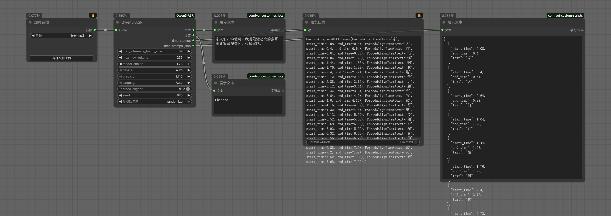

# ComfyUI-Qwen3-ASR



基于阿里巴巴 Qwen 团队开源的 **[Qwen3-ASR](https://github.com/QwenLM/Qwen3-ASR)** 项目，为 ComfyUI 实现的语音转文本节点。

## 📋 更新日志

- **2026-02-01**: 优化依赖和文档
- **2026-01-31**：`Qwen3-ASR`节点开发完成

## 功能特性

- 🎵 **语音识别**: Qwen3-ASR-1.7B 和 Qwen3-ASR-0.6B 支持 30 种语言和 22 种中文方言的语言识别与语音识别，同时涵盖来自多个国家和地区的英语口音。
- 🎭 **时间戳**: 集成Qwen3-ForcedAligner-0.6B，支持对最多 5 分钟的语音在 11 种语言中任意单元进行时间戳预测。

## 安装
### 安装插件
* 使用`ComfyUI-Manager`安装
* 手动安装请参考：
```bash
# 将仓库克隆到comfyui/custom_nodes目录下
git clone https://github.com/mailzwj/ComfyUI-Qwen3-ASR.git
# 安装依赖
pip install -r requirements.txt
# 安装成功后，重启ComfyUI即可
```

### 安装模型
* 节点支持自动下载模型权重，但需确保网络畅通。
* **推荐手动下载模型**，模型存放路径`models/qwen-asr`，目录结构如下（名称需一致）：
  * `models/qwen-asr/Qwen3-ASR-1.7B`：[Huggingface](https://huggingface.co/Qwen/Qwen3-ASR-1.7B)、[Modelscope](https://modelscope.cn/models/Qwen/Qwen3-ASR-1.7B)
  * `models/qwen-asr/Qwen3-ASR-0.6B`：[Huggingface](https://huggingface.co/Qwen/Qwen3-ASR-0.6B)、[Modelscope](https://modelscope.cn/models/Qwen/Qwen3-ASR-0.6B)
  * `models/qwen-asr/Qwen3-ForcedAligner-0.6B`：[Huggingface](https://huggingface.co/Qwen/Qwen3-ForcedAligner-0.6B)、[Modelscope](https://modelscope.cn/models/Qwen/Qwen3-ForcedAligner-0.6B)

## 致谢

- [Qwen3-ASR](https://github.com/QwenLM/Qwen3-ASR): 阿里巴巴 Qwen 团队官方开源仓库。
- [ComfyUI-Qwen-TTS](https://github.com/flybirdxx/ComfyUI-Qwen-TTS): 参考该插件代码实现

## 许可证

- 本项目采用 **Apache License 2.0** 许可证。
